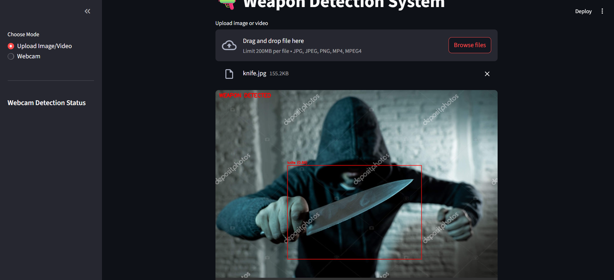
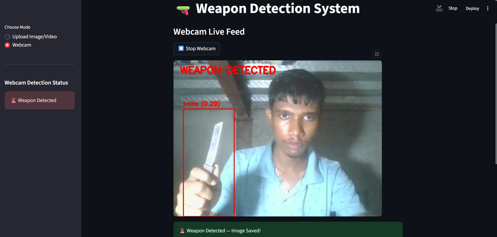
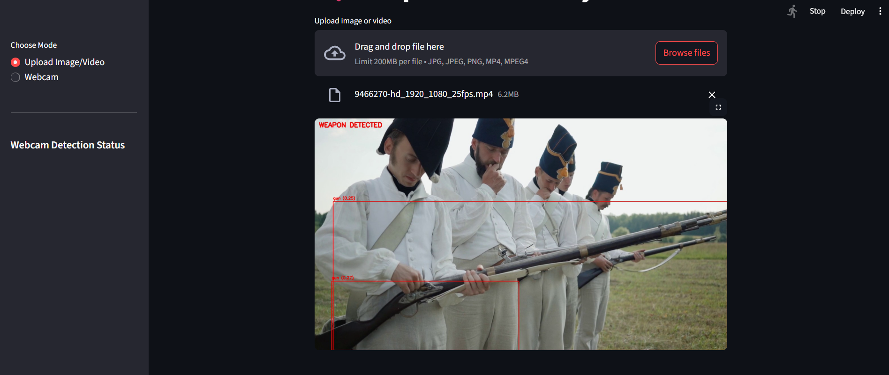
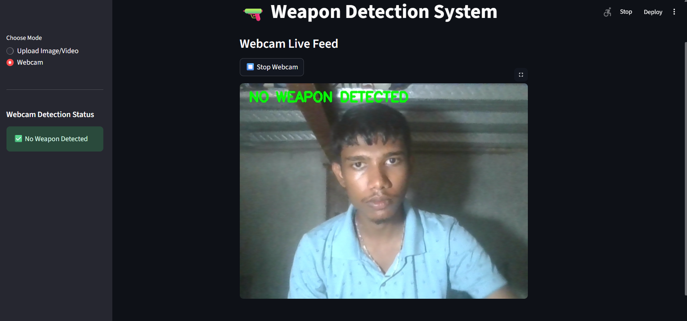

# 🛡️ Weapon Detection System

An AI-powered real-time weapon detection application built with **YOLOv5** and **Streamlit**. This tool helps in identifying dangerous objects such as **guns** and **knives** from images, videos, and live webcam feeds, and alerts the user accordingly.

---

### 🔍 Features

- 📷 **Upload Image/Video** for detection  
- 🎥 **Real-time Webcam Detection**  
- 🧠 Powered by **YOLOv5** (custom-trained model)  
- ✅ Detects **guns** and **knives**  
- 📦 Saves captured frames where a weapon is detected  
- 💻 Built using **Python**, **OpenCV**, **PyTorch**, and **Streamlit**

---

### 📸 Demo Preview

#### 🖼️ Image Upload Detection
The user uploads an image. If a weapon like a **gun** or **knife** is detected, a red bounding box is drawn with a label and confidence score. The system displays a "🚨 Weapon Detected!" message.



---

#### 🎥 Real-time Webcam Detection
The system captures live video frames from your webcam. If a weapon is detected, a bounding box is drawn and a snapshot is saved. You also get a real-time warning on the screen.



---

#### 📹 Video File Detection
You can upload `.mp4` videos. Each frame is scanned for weapons and annotated in real-time.



---

#### ✅ No Weapon Detected View
When no weapon is detected, the system overlays a green message: "✅ No Weapon Detected".



---

### 📁 Project Structure

```
Weapon_detection_sys/
├── app.py                    # Main Streamlit app
├── detected/                 # Stores captured images when weapons are found
├── yolov5/
│   ├── weapon_detection.py   # Detection logic using YOLOv5
│   ├── models/               # YOLOv5 model files
│   ├── utils/                # YOLOv5 utilities
├── best_compatible.pt    # Trained YOLOv5 model  
└── README.md                 # Project readme
```

---

### 🚀 How to Run

#### 1. Clone the repository:
```bash
git clone https://github.com/your-username/weapon-detection-app.git
cd weapon-detection-app
```

#### 2. Install requirements:
```bash
pip install -r requirements.txt
```

<details>
<summary>📦 Common dependencies</summary>

```txt
streamlit
opencv-python
torch
numpy
Pillow
```
</details>

#### 3. Run the app:
```bash
streamlit run app.py
```

---

### 📂 Model Info

The model `best_compatible.pt` is a YOLOv5-based custom-trained object detection model that detects:

- 🔫 Guns  
- 🔪 Knives  

You can retrain or fine-tune it using [Roboflow](https://roboflow.com/) or [YOLOv5 training pipeline](https://github.com/ultralytics/yolov5/wiki/Train-Custom-Data).

---

### 💡 Use Cases

- 🏫 School & campus surveillance  
- 🛂 Security checks in public areas  
- 🏛️ Government or judicial premises  
- 🧪 Academic research on AI + safety

---

### 🛠️ To-Do

- [ ] Add email/SMS alerts  
- [ ] Integrate with external CCTV APIs  
- [ ] Export detection logs  
- [ ] Deploy to cloud (Streamlit Cloud / Heroku)

---

### 📸 Screenshots

<p float="left">
  
  
</p>

---

### 🤝 Contributing

Feel free to open issues or pull requests. All feedback is welcome!

```bash
git checkout -b feature/your-feature-name
```

---

### 📃 License

This project is licensed under the [MIT License](LICENSE).

---

### 👨‍💻 Author

Built by **Rohit Yadav**  
💡 Passionate about AI, Computer Vision, and Real-world Applications
